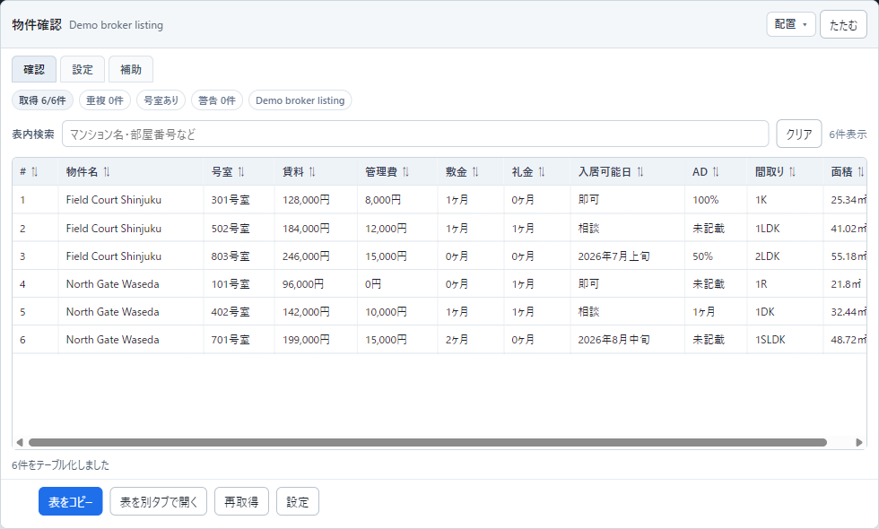

# Real Estate Field Copy Helper

不動産仲介向けの物件ページから必要な項目を抽出し、確認用テーブルとコピー用テキストを作る Tampermonkey/Greasemonkey 用ユーザースクリプトです。

主な想定は、イタンジなどの仲介向け・業務向けサイトで、物件名、号室、賃料、管理費、敷金、礼金、間取り、面積、入居日、AD などをまとめて確認・コピーする用途です。

## 特徴

- ページ上に「物件確認」パネルを表示
- 抽出結果をテーブルで確認
- 表内検索、並び替え、重複候補の確認
- CSSセレクタと正規表現で取得ルールを設定
- AI補助で、ページ全体から候補を探し、部分を決め、必要な形へ整形して表を完成
- AI回答JSONの自動補正、検証、仮プレビュー、修正依頼プロンプト作成
- パネルの左右寄せ、横幅全体、縦半分、縦全体、折りたたみに対応
- サイト別の固定ロジックではなく、画面構造に合わせてユーザー側でルールを調整

## デモ

公開用のダミー物件一覧を `examples/demo-listing.html` に置いています。

このHTMLは実在サイトのスクリーンショットではなく、架空の物件データです。READMEの画像もこのデモページから作成しています。

## インストール

1. ブラウザに Tampermonkey などのユーザースクリプト拡張を入れます。
2. `real-estate-field-copy-helper.user.js` を開きます。
3. Tampermonkey の新規スクリプトとして貼り付けて保存します。
4. 対象サイトを開き、ページ右上の「物件確認」パネルから設定します。

## 使い方

1. 対象の物件一覧ページを開きます。
2. 「設定」を開きます。
3. 「AIと表を完成させる」を開きます。
4. まずページ全体をAIに渡し、候補を探します。
5. AI回答JSONで `1物件のまとまり`、`1部屋のまとまり`、各項目の取得場所を決めます。
6. 賃料、管理費、敷金、礼金、面積、ADなどを必要な形へ整形します。
7. 検証して仮プレビューし、問題なければ仮設定を採用します。
8. 警告がある場合は修正依頼をコピーしてAIに再依頼できます。

## 取得項目

標準では以下の項目を扱います。

- 物件名
- 号室
- 賃料
- 管理費
- 敷金
- 礼金
- 入居可能日
- AD
- 間取り
- 面積

一般向け賃貸サイトでは号室が表示されず階数だけのことがありますが、このツールの主な想定は仲介向けサイトです。号室が取得できる場合は、重複判定でも号室を強めに扱います。

## 正規表現候補

設定画面では、よく使うパターンを選択できます。

- 万円を含む金額
- 円を含む金額
- 管理費・共益費の後ろ
- 敷の後ろ
- 礼の後ろ
- 階、号室、先頭の階/号室
- 間取り
- `㎡`、`m2`、`m²` を含む面積
- 入居日、即入居、相談
- AD、広告料

## 注意

- このスクリプトは、表示中のページ内テキストをブラウザ上で抽出します。
- 外部サーバーへ物件情報を送信する処理はありません。
- サイトのHTML構造が変わると、設定の見直しが必要になる場合があります。
- 公開サイトへの大量アクセスや自動巡回を目的にしたものではありません。
